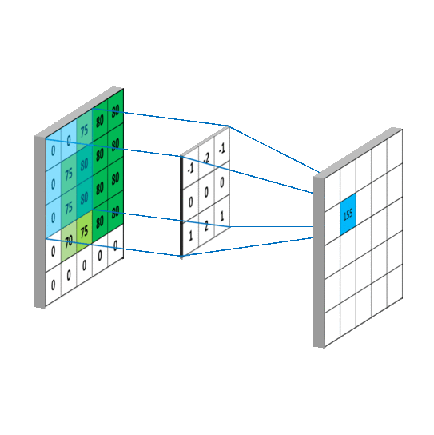

# Assignment To-Do :

**Assignment 1A**

Visit the colab link. Notice the last block. That's a vertical edge detector. The assignment is to find and show (in separate code blocks):

- Horizontal Edge Detector

- 45 Degree Angle Detector (either)

- Blur Kernel

- Sharpen Kernel

- Identity function (doesn't do anything)

**Instructions:**

1. Stick to 3x3 kernels only

2. Do this on Colab, but once done upload to your GitHub Project 1.

3. 50 Marks for Correct Code and 50 marks for great documentation

**Assignment 1B:**

- On your GitHub, add Project 1, and add a readme file (called Assignment 1B). In this readme file, answer the following question:

  1. What are Channels and Kernels (according to EVA)?

  2. Why should we only (well mostly) use 3x3 Kernels?

  3. How many times do we need to perform 3x3 convolution operation to reach 1x1 from 199x199 (show calculations)

- 50 Marks for your explanation and 50 Marks for your creativity

- Keep your project Private,  and add "theschoolofai" or "admin@theschoolofai.in" as a collaborator
  Upload GitHub Project 1 link to LMS (make sure you have added theschoolofai as a collaborator)

- Deadline 1 hour before your next session.

- You MUST use your own words while writing any of the above, if we find plagiarism, 0 marks would be awarded for that article.

## Assignment 1B :

1. **What are channels and kernels?**

   **Kernels** is like a matrix that runs over the image matrix (large matrix). Every kernel is made to extract features from the large matrix or image. The kernel slides over the image, performs elementary operations such as additions and multiplications, and sums up the result into one pixel. It reduces the size of the image. New image size is M-(N-1) where M and N are image and kernel sizes respectively.

   

   The bottom images shows different types of kernels which will extract features from the image based on their kernel matrix values.

   

   

   **Channels** on the other hand, are formed by kernels. After every kernel performs it operations, each kernel provides different set of features, but one kernel only provides one type of features. So this feature space of the whole image produces one channel. In general, we have 3 channels, RGB. So channels are like a bag of similar features extracted from an image by a particular kernel type.

   

   

2. **Why should we only (well mostly) use 3x3 Kernels?**

   Kernels can be of any size but generally speaking we have two attributes of an kernel we need to look. First one is how well a kernel fits the image and second one is computations. Lets describe each in detail : 

   - Kernel fits the image well if it has odd dimensions. It is because odd dimension kernels have an central axis, hence more efficiently fits over the image.

   - Computations plays an important role. If the size of kernel is large, then amount of computations and resources such as RAM and GPU consumption is large and more prone to OOM (Out Of Memory) errors. 

     Number of computations are directly proportional to (size of kernel)^2.

   

   ​	Based on the above facts, we can choose 3x3 kernel as it is small and odd and also number of computations are very 3^2 = 9, which is very less. Also its more popular since it was used in many state of the art architectures since 2012.

   

   

3. **How many times do we need to perform 3x3 convolution operation to reach 1x1 from 199x199 (show calculations)**

   With each 3x3 convolution, the size of the image is reduced by 2. Hence, simple math suggest it requires 99 convolution operations to reach to 1x1 image size.

   199 x 199  | 3x3 >>  197 x 197

   197 x 197  | 3x3 >>  195 x 195

   195 x 195  | 3x3 >>  193 x 193

   193 x 193  | 3x3 >>  191 x 191

   191 x 191  | 3x3 >>  189 x 189

   189 x 189  | 3x3 >>  187 x 187

   187 x 187  | 3x3 >>  185 x 185

   185 x 185  | 3x3 >>  183 x 183

   183 x 183  | 3x3 >>  181 x 181

   181 x 181  | 3x3 >>  179 x 179

   179 x 179  | 3x3 >>  177 x 177

   177 x 177  | 3x3 >>  175 x 175

   175 x 175  | 3x3 >>  173 x 173

   173 x 173  | 3x3 >>  171 x 171

   171 x 171  | 3x3 >>  169 x 169

   169 x 169  | 3x3 >>  167 x 167

   167 x 167  | 3x3 >>  165 x 165

   165 x 165  | 3x3 >>  163 x 163

   163 x 163  | 3x3 >>  161 x 161

   161 x 161  | 3x3 >>  159 x 159

   159 x 159  | 3x3 >>  157 x 157

   157 x 157  | 3x3 >>  155 x 155

   155 x 155  | 3x3 >>  153 x 153

   153 x 153  | 3x3 >>  151 x 151

   151 x 151  | 3x3 >>  149 x 149

   149 x 149  | 3x3 >>  147 x 147

   147 x 147  | 3x3 >>  145 x 145

   145 x 145  | 3x3 >>  143 x 143

   143 x 143  | 3x3 >>  141 x 141

   141 x 141  | 3x3 >>  139 x 139

   139 x 139  | 3x3 >>  137 x 137

   137 x 137  | 3x3 >>  135 x 135

   135 x 135  | 3x3 >>  133 x 133

   133 x 133  | 3x3 >>  131 x 131

   131 x 131  | 3x3 >>  129 x 129

   129 x 129  | 3x3 >>  127 x 127

   127 x 127  | 3x3 >>  125 x 125

   125 x 125  | 3x3 >>  123 x 123

   123 x 123  | 3x3 >>  121 x 121

   121 x 121  | 3x3 >>  119 x 119

   119 x 119  | 3x3 >>  117 x 117

   117 x 117  | 3x3 >>  115 x 115

   115 x 115  | 3x3 >>  113 x 113

   113 x 113  | 3x3 >>  111 x 111

   111 x 111  | 3x3 >>  109 x 109

   109 x 109  | 3x3 >>  107 x 107

   107 x 107  | 3x3 >>  105 x 105

   105 x 105  | 3x3 >>  103 x 103

   103 x 103  | 3x3 >>  101 x 101

   101 x 101  | 3x3 >>  99 x 99

   99 x 99  | 3x3 >>  97 x 97

   97 x 97  | 3x3 >>  95 x 95

   95 x 95  | 3x3 >>  93 x 93

   93 x 93  | 3x3 >>  91 x 91

   91 x 91  | 3x3 >>  89 x 89

   89 x 89  | 3x3 >>  87 x 87

   87 x 87  | 3x3 >>  85 x 85

   85 x 85  | 3x3 >>  83 x 83

   83 x 83  | 3x3 >>  81 x 81

   81 x 81  | 3x3 >>  79 x 79

   79 x 79  | 3x3 >>  77 x 77

   77 x 77  | 3x3 >>  75 x 75

   75 x 75  | 3x3 >>  73 x 73

   73 x 73  | 3x3 >>  71 x 71

   71 x 71  | 3x3 >>  69 x 69

   69 x 69  | 3x3 >>  67 x 67

   67 x 67  | 3x3 >>  65 x 65

   65 x 65  | 3x3 >>  63 x 63

   63 x 63  | 3x3 >>  61 x 61

   61 x 61  | 3x3 >>  59 x 59

   59 x 59  | 3x3 >>  57 x 57

   57 x 57  | 3x3 >>  55 x 55

   55 x 55  | 3x3 >>  53 x 53

   53 x 53  | 3x3 >>  51 x 51

   51 x 51  | 3x3 >>  49 x 49

   49 x 49  | 3x3 >>  47 x 47

   47 x 47  | 3x3 >>  45 x 45

   45 x 45  | 3x3 >>  43 x 43

   43 x 43  | 3x3 >>  41 x 41

   41 x 41  | 3x3 >>  39 x 39

   39 x 39  | 3x3 >>  37 x 37

   37 x 37  | 3x3 >>  35 x 35

   35 x 35  | 3x3 >>  33 x 33

   33 x 33  | 3x3 >>  31 x 31

   31 x 31  | 3x3 >>  29 x 29

   29 x 29  | 3x3 >>  27 x 27

   27 x 27  | 3x3 >>  25 x 25

   25 x 25  | 3x3 >>  23 x 23

   23 x 23  | 3x3 >>  21 x 21

   21 x 21  | 3x3 >>  19 x 19

   19 x 19  | 3x3 >>  17 x 17

   17 x 17  | 3x3 >>  15 x 15

   15 x 15  | 3x3 >>  13 x 13

   13 x 13  | 3x3 >>  11 x 11

   11 x 11  | 3x3 >>  9 x 9

   9 x 9  | 3x3 >>  7 x 7

   7 x 7  | 3x3 >>  5 x 5

   5 x 5  | 3x3 >>  3 x 3

   3 x 3  | 3x3 >>  1 x 1

