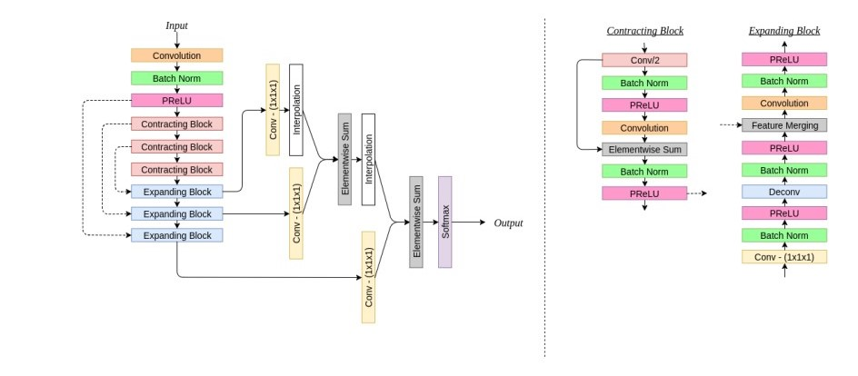
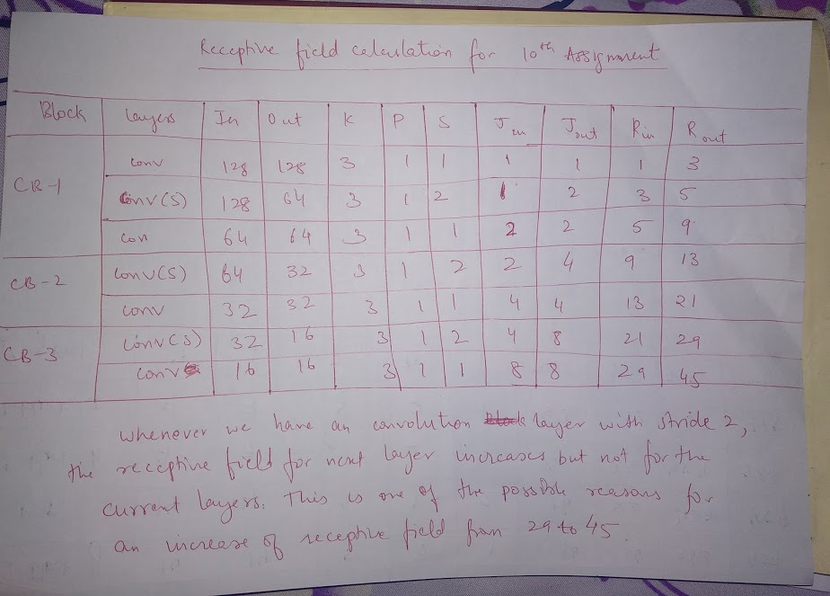

# <u>10-B: Increase in Receptive field from 29 -> 45</u>

#### Possible reason: 

Whenever we have a convolution layer with stride 2, or max pool or any layer which tries to modify image dimensions by a drastic change, these layers increases the receptive field by a large number.

It is evident from the calculation shown in the image above that the receptive field has increase by a larger margin just after the convolution layer with stride 2. Hence, at 29, we have a stride 2 convolution layer, which increases the receptive field for next layer but not for self.