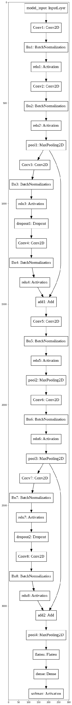

# Assignment 14: High's & Low's

<u>NOTE: Even though a base network was given, to get a clear & deeper understanding of the architecture, & its underlying hyper-parameters, augmentations & other optimizations, I have experimented and followed multi sources to check what works and what doesn't. The final results & values are present in the "ipynb" file.</u>


#### Final results:

##### <u>94.1% Validation Accuracy, 420 Seconds, 20 Epochs</u>


### 1. Major references

[How to train your ResNet](https://myrtle.ai/how-to-train-your-resnet/) : A great source to analyze and understand how, why & what contributes to every piece of evidences learned by a deep learning model. It helped me to gain more insights as well as deeper understanding of so many concepts related to time, batch normalization & convolutions as a whole.

[DAWN Benchmar on Cifar10](https://dawn.cs.stanford.edu/benchmark/CIFAR10/train.html) : Some of the most inspiring & motivational results out here are just beyond imagination. Even though large number of submissions are on pytorch, the techniques used always indulge me to why or how a particular strategy works or doesn't.


### 2. The Architecture: DavidNet [or] Small ResNet [or] ResNet9


The network in the base network was simplified during experiments & the simpler architecture code is:

```python
def resnet_small():


 input_shape = (32,32,3)

 model_input = Input(input_shape,name="model_input")


 \## cluster prep block

 conv1 = Conv2D(filters=64,kernel_size=(3,3),strides=(1,1),padding="same",use_bias=False,name="Conv1",kernel_regularizer=l2(5e-4))(model_input)

 bn1 = BatchNormalization(epsilon=1e-5,momentum=0.1,name="Bn1")(conv1)

 rl1 = Activation('relu',name="relu1")(bn1)


 \#cluster_layer_1

 conv2 = Conv2D(filters=128,kernel_size=(3,3),strides=(1,1),padding="same",use_bias=False,name="Conv2",kernel_regularizer=l2(5e-4))(rl1)

 bn2 = BatchNormalization(epsilon=1e-5,momentum=0.1,name="Bn2")(conv2)

 rl2 = Activation('relu',name="relu2")(bn2)


 pool1 = MaxPool2D(pool_size=(2,2),strides=(2,2),name="pool1")(rl2)


 \# id1 = Lambda(lambda x: x)(pool1)


 \#cluster_layer_1_residuals

 \#cluster_layer_1_residual_layer_1

 conv3 = Conv2D(filters=128,kernel_size=(3,3),strides=(1,1),padding="same",use_bias=False,name="Conv3",kernel_regularizer=l2(5e-4))(pool1)

 bn3 = BatchNormalization(epsilon=1e-5,momentum=0.1,name="Bn3")(conv3)

 rl3 = Activation('relu',name="relu3")(bn3)

 drop1 = Dropout(0.1,name="dropout1")(rl3)


 \# cluster_layer_1_residual_layer_2

 conv4 = Conv2D(filters=128,kernel_size=(3,3),strides=(1,1),padding="same",use_bias=False,name="Conv4",kernel_regularizer=l2(5e-4))(drop1)

 bn4 = BatchNormalization(epsilon=1e-5,momentum=0.1,name="Bn4")(conv4)

 rl4 = Activation('relu',name="relu4")(bn4)


 \#cluster_layer_1_residuals_end

 add1 = add([pool1,rl4],name="add1")


 \#cluster_layer_2

 conv5 = Conv2D(filters=256,kernel_size=(3,3),strides=(1,1),padding="same",use_bias=False,name="Conv5",kernel_regularizer=l2(5e-4))(add1)

 bn5 = BatchNormalization(epsilon=1e-5,momentum=0.1,name="Bn5")(conv5)

 rl5 = Activation('relu',name="relu5")(bn5)


 pool2 = MaxPool2D(pool_size=(2,2),strides=(2,2),name="pool2")(rl5)


 \#cluster_layer_3

 conv6 = Conv2D(filters=512,kernel_size=(3,3),strides=(1,1),padding="same",use_bias=False,name="Conv6",kernel_regularizer=l2(5e-4))(pool2)

 bn6 = BatchNormalization(epsilon=1e-5,momentum=0.1,name="Bn6")(conv6)

 rl6 = Activation('relu',name="relu6")(bn6)


 pool3 = MaxPool2D(pool_size=(2,2),strides=(2,2),name="pool3")(rl6)


 \# id2 = Lambda(lambda x: x)(pool3)


 \#cluster_layer_2_residuals

 \#cluster_layer_2_residual_layer_1

 conv7 = Conv2D(filters=512,kernel_size=(3,3),strides=(1,1),padding="same",use_bias=False,name="Conv7",kernel_regularizer=l2(5e-4))(pool3)

 bn7 = BatchNormalization(epsilon=1e-5,momentum=0.1,name="Bn7")(conv7)

 rl7 = Activation('relu',name="relu7")(bn7)

 drop2 = Dropout(0.1,name="dropout2")(rl7)


 \# cluster_layer_2_residual_layer_2

 conv8 = Conv2D(filters=512,kernel_size=(3,3),strides=(1,1),padding="same",use_bias=False,name="Conv8",kernel_regularizer=l2(5e-4))(drop2)

 bn8 = BatchNormalization(epsilon=1e-5,momentum=0.1,name="Bn8")(conv8)

 rl8 = Activation('relu',name="relu8")(bn8)


 \#cluster_layer_2_residuals_end

 add2 = add([pool3,rl8],name="add2")


 pool4 = MaxPool2D(pool_size=(4,4),strides=(4,4),name="pool4")(add2)


 \## flatten & output

 flt = Flatten(name="flatten")(pool4)

 dense = Dense(units=10,use_bias=False,name="dense")(flt)

 classifier = Activation('softmax',name="softmax")(dense)


 \#define model

 model = Model(inputs=model_input,outputs=classifier)


 return model
```



  

This architecture has:

1. Total params: 6,577,600
2. Trainable params: 6,573,120
3. Non-trainable params: 4,480

##### Constant parameters through out the experiment:

SGD: 

- learning rate: 0.01
- momentum: 0.9
- nesterov: True
- decay: 1e-5

Batch Size: 512

Weight Decay: 5e-4


 