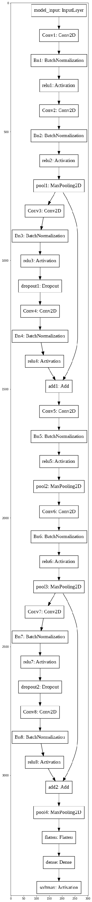
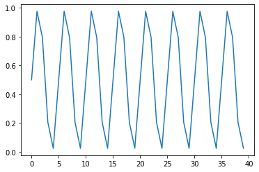
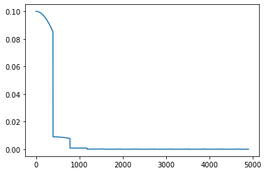
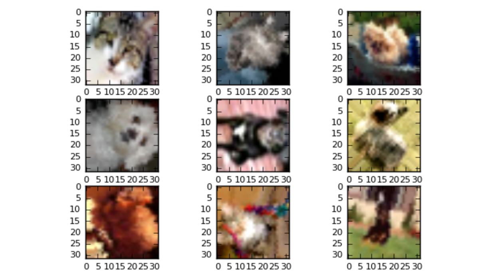
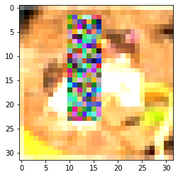
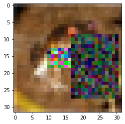
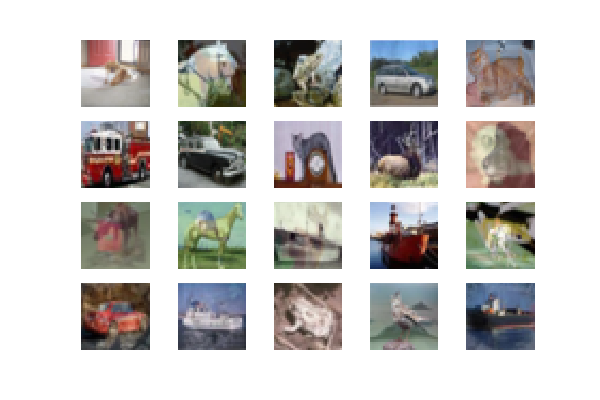

# Assignment 14: High's & Low's

<u>NOTE: Even though a base network was given, to get a clear & deeper understanding of the architecture, & its underlying hyper-parameters, augmentations & other optimizations, I have experimented and followed multi sources to check what works and what doesn't. The final results & values are present in the "ipynb" file.</u>


#### Final results:

##### <u>94.1% Validation Accuracy, 416.04 Seconds, 20 Epochs</u>


### 1. Major references

[How to train your ResNet](https://myrtle.ai/how-to-train-your-resnet/) : A great source to analyze and understand how, why & what contributes to every piece of evidences learned by a deep learning model. It helped me to gain more insights as well as deeper understanding of so many concepts related to time, batch normalization & convolutions as a whole.

[DAWN Benchmar on Cifar10](https://dawn.cs.stanford.edu/benchmark/CIFAR10/train.html) : Some of the most inspiring & motivational results out here are just beyond imagination. Even though large number of submissions are on pytorch, the techniques used always indulge me to why or how a particular strategy works or doesn't.


### 2. The Architecture: DavidNet [or] Small ResNet [or] ResNet9


The network in the base network was simplified during experiments & the simpler architecture code is:

```python
def resnet_small():


 input_shape = (32,32,3)

 model_input = Input(input_shape,name="model_input")


 ## cluster prep block

 conv1 = Conv2D(filters=64,kernel_size=(3,3),strides=(1,1),padding="same",use_bias=False,name="Conv1",kernel_regularizer=l2(5e-4))(model_input)

 bn1 = BatchNormalization(epsilon=1e-5,momentum=0.1,name="Bn1")(conv1)

 rl1 = Activation('relu',name="relu1")(bn1)


 #cluster_layer_1

 conv2 = Conv2D(filters=128,kernel_size=(3,3),strides=(1,1),padding="same",use_bias=False,name="Conv2",kernel_regularizer=l2(5e-4))(rl1)

 bn2 = BatchNormalization(epsilon=1e-5,momentum=0.1,name="Bn2")(conv2)

 rl2 = Activation('relu',name="relu2")(bn2)


 pool1 = MaxPool2D(pool_size=(2,2),strides=(2,2),name="pool1")(rl2)


 # id1 = Lambda(lambda x: x)(pool1)


 #cluster_layer_1_residuals

 #cluster_layer_1_residual_layer_1

 conv3 = Conv2D(filters=128,kernel_size=(3,3),strides=(1,1),padding="same",use_bias=False,name="Conv3",kernel_regularizer=l2(5e-4))(pool1)

 bn3 = BatchNormalization(epsilon=1e-5,momentum=0.1,name="Bn3")(conv3)

 rl3 = Activation('relu',name="relu3")(bn3)

 drop1 = Dropout(0.1,name="dropout1")(rl3)


 # cluster_layer_1_residual_layer_2

 conv4 = Conv2D(filters=128,kernel_size=(3,3),strides=(1,1),padding="same",use_bias=False,name="Conv4",kernel_regularizer=l2(5e-4))(drop1)

 bn4 = BatchNormalization(epsilon=1e-5,momentum=0.1,name="Bn4")(conv4)

 rl4 = Activation('relu',name="relu4")(bn4)


 #cluster_layer_1_residuals_end

 add1 = add([pool1,rl4],name="add1")


 #cluster_layer_2

 conv5 = Conv2D(filters=256,kernel_size=(3,3),strides=(1,1),padding="same",use_bias=False,name="Conv5",kernel_regularizer=l2(5e-4))(add1)

 bn5 = BatchNormalization(epsilon=1e-5,momentum=0.1,name="Bn5")(conv5)

 rl5 = Activation('relu',name="relu5")(bn5)


 pool2 = MaxPool2D(pool_size=(2,2),strides=(2,2),name="pool2")(rl5)


 #cluster_layer_3

 conv6 = Conv2D(filters=512,kernel_size=(3,3),strides=(1,1),padding="same",use_bias=False,name="Conv6",kernel_regularizer=l2(5e-4))(pool2)

 bn6 = BatchNormalization(epsilon=1e-5,momentum=0.1,name="Bn6")(conv6)

 rl6 = Activation('relu',name="relu6")(bn6)


 pool3 = MaxPool2D(pool_size=(2,2),strides=(2,2),name="pool3")(rl6)


 # id2 = Lambda(lambda x: x)(pool3)


 #cluster_layer_2_residuals

 #cluster_layer_2_residual_layer_1

 conv7 = Conv2D(filters=512,kernel_size=(3,3),strides=(1,1),padding="same",use_bias=False,name="Conv7",kernel_regularizer=l2(5e-4))(pool3)

 bn7 = BatchNormalization(epsilon=1e-5,momentum=0.1,name="Bn7")(conv7)

 rl7 = Activation('relu',name="relu7")(bn7)

 drop2 = Dropout(0.1,name="dropout2")(rl7)


 # cluster_layer_2_residual_layer_2

 conv8 = Conv2D(filters=512,kernel_size=(3,3),strides=(1,1),padding="same",use_bias=False,name="Conv8",kernel_regularizer=l2(5e-4))(drop2)

 bn8 = BatchNormalization(epsilon=1e-5,momentum=0.1,name="Bn8")(conv8)

 rl8 = Activation('relu',name="relu8")(bn8)


 #cluster_layer_2_residuals_end

 add2 = add([pool3,rl8],name="add2")


 pool4 = MaxPool2D(pool_size=(4,4),strides=(4,4),name="pool4")(add2)


 ## flatten & output

 flt = Flatten(name="flatten")(pool4)

 dense = Dense(units=10,use_bias=False,name="dense")(flt)

 classifier = Activation('softmax',name="softmax")(dense)


 #define model

 model = Model(inputs=model_input,outputs=classifier)


 return model
```



  

This architecture has:

1. Total params: 6,577,600
2. Trainable params: 6,573,120
3. Non-trainable params: 4,480

##### Constant parameters through out the experiment:

SGD: 

- learning rate: 0.01
- momentum: 0.9
- nesterov: True
- decay: 1e-5

Batch Size: 512

Weight Decay: 5e-4


 ### Trials, Optimizations, Random Tuning & Results

#### 1. Learning rate:

I initially tried first few training sessions with triangular, then triangular 2 and then Exp. However Triangular2 and Exp did not produce any better results than triangular. 

Also with Triangular, I had a check with multi step sizes and found out that among all the other step sizes, the best results were accumulated around 

```python
4*(len(training_data)/batch_size)
```

and I was able to get 92% accuracy every 4/5. Max learning rate varied between 0.1 to 0.4 & base learning rate varied between 0.001 to 0.00001. Also i decided to tweak the triangular policy with custom clr_function. The tweaked clr function produced the following curve:



The custom cyclic learning rate function did not come too much for help but this also resulted in 92% every 2/5 time. Custom function was produced using the following code

```python
clr_fn = lambda x: 0.5*(1+np.sin(x*np.pi/2.5))
```


Not to mention that davidnet used an hard coded learning rate function called the piecewise distribution in pytorch & interpolation in numpy. I tried another approach to write this function by producing 2 lines slops with +0.1068 during rising learning rate phase and a -0.01059 during the slanted decreasing learning rate phase. However, on examining the same during training, it disappointed badly and was merely able to produce 83% validation accuracy. I also tried SGD scheduler but it also produced disappointed results. Here is the learning rate curve



#### 2. Weird Identity Layer

I am still wondering how identity layer would affect the overall accuracy of the architecture. Throughout my experiments, I have observed this weird trend of not able achieve higher accuracy with identity layer when compared to the architecture which is without identity layer. This is the reason why the above network code has identity layer connection commented.

#### 3. Image Augmentation part 1: Rotation, Flip, padding, Gaussian Blur, & Cropping

Rotating the images with +-15 degree was not so helpful, as the accuracy still wander about 92%. However rotation with horizontal flipping 50% of images randomly increased the accuracy by 0.2%, which indicates that the dataset had a few reverse horizontal images. Cropping along with padding on 32x32 would always cut out some region on the images. One of the initial mistakes I did during experiment was to apply cropping before padding and then appending 4px padding on side with 'reflection' mode. Due to this, the accuracy decreased from 92.2% to 87%. That is because after applying cropping, any of the random edges were cropped off and filled with reflection mode which resulted in poorly object constructed images. Applying Gaussian blur using [ImgAug](https://github.com/aleju/imgaug) was a great and easy way to implement the above. ImgAug helped me to apply padding before cropping and the accuracy further increased by 0.15%. All this is under the base assumption that time is not yet considered and it should only be considered once we achieve the target accuracy of 94%. So the final accuracy saturated between 92.2% to 92.45%.

Sample of ImgAug rotation:



Some of the implementations of augmentations were taken from [data-augmentation-using-tensorflow-data-dataset](https://www.wouterbulten.nl/blog/tech/data-augmentation-using-tensorflow-data-dataset/). Its a beautiful yet awesome blog to have a complete idea of image augmentation using tensorflow. Applying all these augmentations still did not increase accuracy to 93%. It was frustrating yet interesting to find our and explore more. 

#### 4. Cutout & Mixup (major increase)

Cutout is an advanced image augmentation which randomly cutouts an NxN pixel segment from an image of size MxM. Note that N<M. Here I have taken an sample image and applied cutout 2 times on the same with different normalization values. The first normalization values are between range (0,1) and the second images consists with normalization values in range(0,127). 





Both the images are of frog class but with different normalization values. Cutout boosted accuracy by 0.3% to 0.4% every 4/5 and 3/5 times respectively. The code for cutout is:

```python
### cutout
# The code is taken from [https://github.com/yu4u/cutout-random-erasing]

## here the v_h value varry based on the normalization values.

def get_random_eraser(p=0.5, s_l=0.02, s_h=0.4, r_1=0.3, r_2=1/0.3, v_l=0, v_h=255, pixel_level=True):
    def eraser(input_img):
        img_h, img_w, img_c = input_img.shape
        p_1 = np.random.rand()

        if p_1 > p:
            return input_img

        while True:
            s = np.random.uniform(s_l, s_h) * img_h * img_w
            r = np.random.uniform(r_1, r_2)
            w = int(np.sqrt(s / r))
            h = int(np.sqrt(s * r))
            left = np.random.randint(0, img_w)
            top = np.random.randint(0, img_h)

            if left + w <= img_w and top + h <= img_h:
                break

        if pixel_level:
            c = np.random.uniform(v_l, v_h, (h, w, img_c))
        else:
            c = np.random.uniform(v_l, v_h)

        input_img[top:top + h, left:left + w, :] = c

        return input_img

    return eraser
```

Also it was evident based on many experiments that the normalization values between the range(0,1) produced better results. Hence the final accuracy with cutout and with best of previous augmentations finally clocked 92.9% to 93%. 

Mixup, another great image augmentation technique which mixes up random images to form to new images. David in his blog, [How to train your ResNet](https://myrtle.ai/how-to-train-your-resnet/) also mentioned about the mixup, which was proposed by Hongyi Zhang, Moustapha Cisse, Yann N. Dauphin, & David Lopez-Paz at ICLR2018 in the paper titled ["mixup: Beyond Empirical Risk Minimization"](https://arxiv.org/abs/1710.09412) and conducted by Facebook research labs.  In the paper,  the same issues are  covered which were covered under  David's blogs. Using standing ERM approach causes 2 main issues, which is forgetfulness and generalization. Thus, mixup solves these by augmenting in such a way that proportion of the images are still maintained and yet the model continues to learn by generalizing the images rather than memorizing them, which happens a lot due to similar training epochs run over multiple times. Mixup extends the training distribution by encoperating prior knowledge that linear interpolations of feature vectors should be lead to linear interpolations of associated targets. A pytorch implementation of mixup one by facebook is available [here](https://github.com/facebookresearch/mixup-cifar10).The code for Mixup used in my experiments is,

```python
### MIXUP
# It is taken from [https://github.com/yu4u/mixup-generator].

class MixupGenerator():
    def __init__(self, X_train, y_train, batch_size=512, alpha=0.2, shuffle=True, datagen=None):
        self.X_train = X_train
        self.y_train = y_train
        self.batch_size = batch_size
        self.alpha = alpha
        self.shuffle = shuffle
        self.sample_num = len(X_train)
        self.datagen = datagen

    def __call__(self):
        while True:
            indexes = self.__get_exploration_order()
            itr_num = int(len(indexes) // (self.batch_size * 2))

            for i in range(itr_num):
                batch_ids = indexes[i * self.batch_size * 2:(i + 1) * self.batch_size * 2]
                X, y = self.__data_generation(batch_ids)

                yield X, y

    def __get_exploration_order(self):
        indexes = np.arange(self.sample_num)

        if self.shuffle:
            np.random.shuffle(indexes)

        return indexes

    def __data_generation(self, batch_ids):
        _, h, w, c = self.X_train.shape
        l = np.random.beta(self.alpha, self.alpha, self.batch_size)
        X_l = l.reshape(self.batch_size, 1, 1, 1)
        y_l = l.reshape(self.batch_size, 1)

        X1 = self.X_train[batch_ids[:self.batch_size]]
        X2 = self.X_train[batch_ids[self.batch_size:]]
        X = X1 * X_l + X2 * (1 - X_l)

        if self.datagen:
            for i in range(self.batch_size):
                X[i] = self.datagen.random_transform(X[i])
                X[i] = self.datagen.standardize(X[i])

        if isinstance(self.y_train, list):
            y = []

            for y_train_ in self.y_train:
                y1 = y_train_[batch_ids[:self.batch_size]]
                y2 = y_train_[batch_ids[self.batch_size:]]
                y.append(y1 * y_l + y2 * (1 - y_l))
        else:
            y1 = self.y_train[batch_ids[:self.batch_size]]
            y2 = self.y_train[batch_ids[self.batch_size:]]
            y = y1 * y_l + y2 * (1 - y_l)

        return X, y
```

A sample of mixup training set example is



I used mixup along with cutout as a preprocessing function in ImageDataGenerator and it increased my accuracy from 93% to 93.4%. Hence I was able to obtain every 3/5 times. Finally, combining all the previous augmentations as well as current, i was able to cross 93.5% easily and was close to 93.8%. So, now i moved on from experiment notebook the default code provided and added the same there and this base code and was able to cross 94% every 3/5 times run.

#### 5. Final run

Finally after testing on each parameters, Augmentation techniques, architecture and learning rates, i was able to cross 94% accuracy. However time was still the most difficult phase for me to reduce. When the base code was given, a simple run it required 384 seconds without any advanced image augmentation techniques. I was able to reduced it by removing the x_train,y_train from the outer loop and pulled it outside the loop to first apply image augmentation and then do the training phase. This reduced the time by 20 seconds. However, after implementing the experimented techniques, the time again increased by 70 seconds, which is the reasons why It took 416 seconds to reach the target accuracy. Now I'm looking forward to continue my research on this and try to reduce the time and get more insights from other blogs as well as David's how to train your ResNet. 

