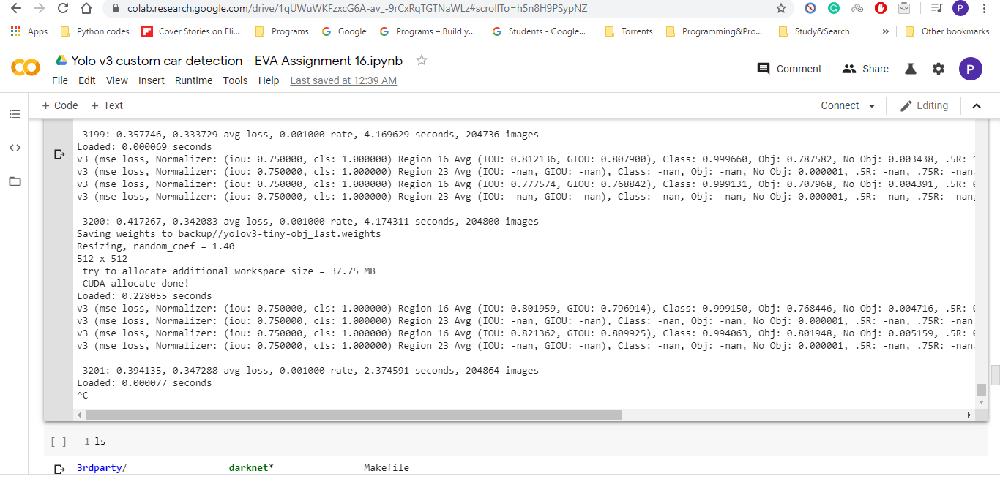

# Custom Yolo-v3 Object detection

[Original Link to video](https://youtu.be/xc1zsUC_JSQ)

[Uploaded video after object detection](https://youtu.be/xc1zsUC_JSQ)

### Steps:

1. Downloaded 239 car images & annotated them. 
2. Trained for 3201 Epochs & tested on weight file of last_3200.weights
3. Downloaded the original video and the output video is the one which is uploaded.

#### Test Image:

#### Prediction image:

#### Output Video

<video controls width="300" height="300">
    <source src="./video/output_video.mp4"
            type="video/mp4">
    Sorry, your browser doesn't support embedded videos.
</video>

#### Epochs snippet

 