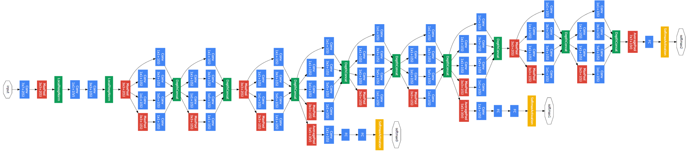
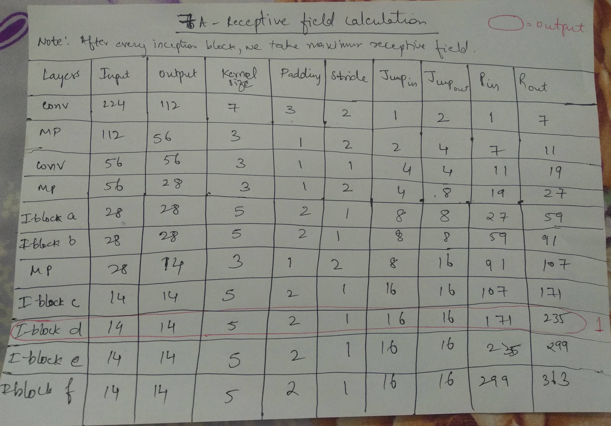
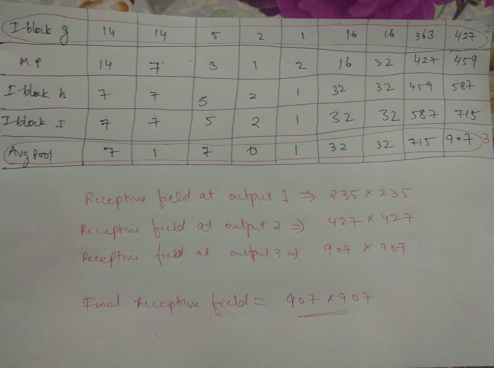

# Receptive Field Calculation - 7A

Google LeNet network architecture: 

Calculation for receptive field:

### Final receptive field @Output 1 : 235x235

### Final receptive field @Output 2 : 427x427

### Final receptive field @Output 3 :  907x907